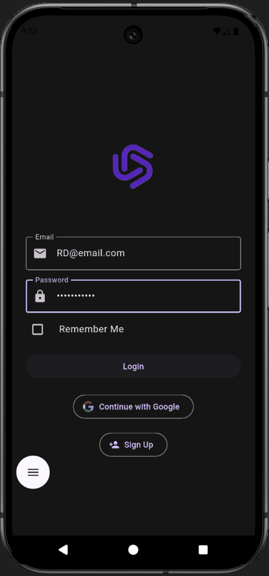
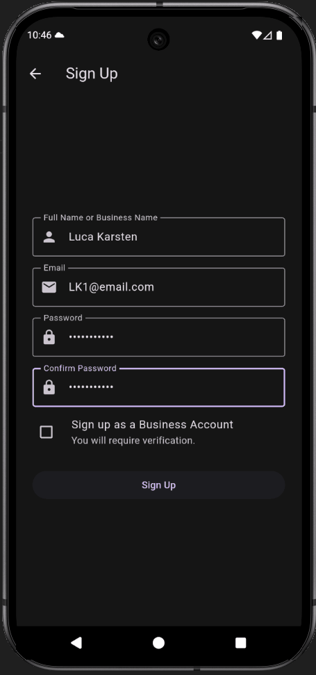
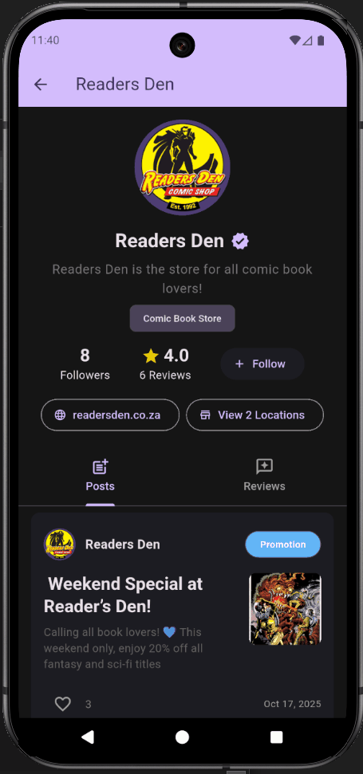
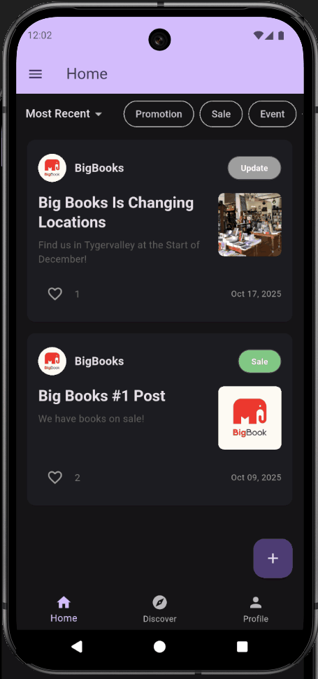
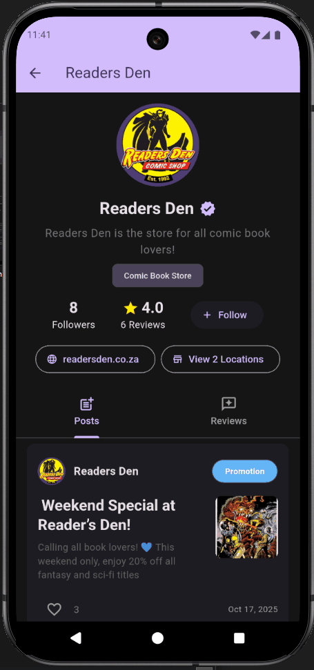
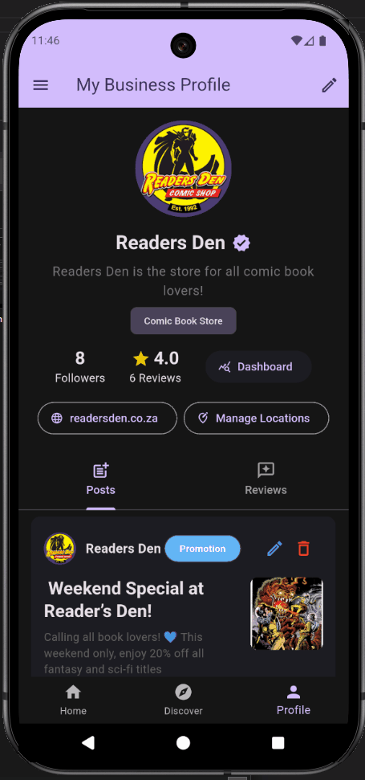
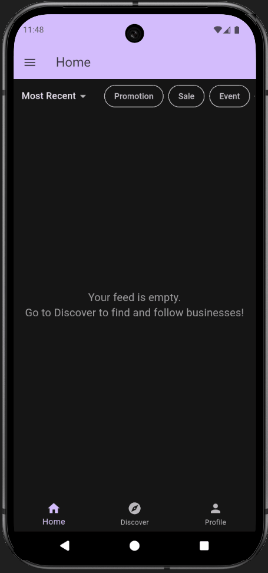
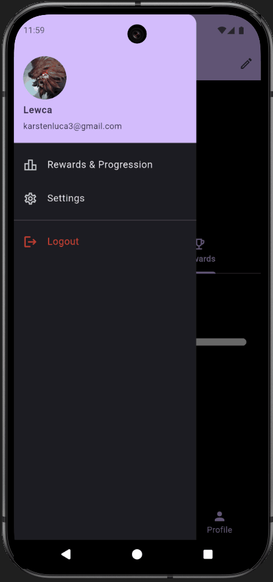

# EngagePoint App - Engagement Application

EngagePoint is a Android mobile application designed to bridge the digital engagement gap for small and medium-sized enterprises. It provides a platform for businesses to build direct customer connections, showcase products, and send targeted notifications.

This repository serves as a portfolio showcase for my contributions to this group project. The original project repository is currently private.

---

## My Role: Flutter App (Frontend & Backend) 

I was responsible for the Flutter app. I built and integrated the frontend and backend-as-a-service components.

### 1. Frontend Development (Flutter/Dart)
* **UI/UX:** Designed and built  the mobile application's screens, components, and navigation flow.
* **State Management:** Implemented app-wide state management for user data, posts, and feeds.
* **Core Features:** Developed all user-facing features, including:
    * User registration, login, and profile management.
    * The "Discover" page for finding businesses.
    * The "Home" feed, including filtering logic (by post tags, sort by likes, etc.).
    * The review and rating system.
    * The business-facing "Create Post" and profile pages.

### 2. Backend-as-a-Service (Firebase)
* **Database:** Structured and provisioned the entire **Firestore database**, including all collections, documents, and data models.
* **Authentication:** Implemented **Firebase Auth** for all user login, registration, and session management.
* **Database Logic:** Wrote queries and business logic for interacting with Firestore (following a business, fetching posts, submitting a review etc.).
* **Security:** Wrote **Firestore Security Rules** to protect user data and ensure users could only access and write their own information.
* **Push Notifications:** Set up and configured **Firebase Cloud Messaging (FCM)** to allow the app to receive notifications.

---

## Core Feature GIFs

| Email Login | Google Login | Sign-Up |
| :---: | :---: | :---: |
|  |  |  |

| Feed Demo & Tag Filtering | Posts & Reviews | Creating Posts & Editing Details |
| :---: | :---: | :---: |
|  |  |  | 

| Business Website & Locations | Business DashBoards | Rewards & Progression | Settings |
| :---: | :---: | :---: | :---: |
|  |  |  |  |

---

## Architecture & Tech Stack

**Frontend:**
* **Flutter (Dart)** – Cross-platform mobile app (Android + iOS)

**Backend (Core):**
* **Firebase Auth** – User authentication & role management
* **Firestore** – NoSQL database for users, businesses, posts, etc.
* **Firebase Cloud Messaging** – Push notifications
* **Firebase Cloud Functions** – Event-driven logic

**Backend (Microservices):**
* **C# (ASP.NET Core)** – Engagement analytics & business verification
* **Python** – Sentiment analysis & content moderation
* **Java** – Post Scheduling Service

---

## Features

* **User Roles:** Subscribers, Businesses, and Admins with unique permissions.
* **Personalized Feeds:** Users can follow businesses and receive a custom feed of posts.
* **Product Catalogs:** Businesses can manage and showcase their products.
* **Push Notifications:** Customizable notifications for promotions and updates.
* **Review System:** Users can leave reviews, which are processed by a **Python sentiment analysis** service.
* **Analytics Dashboard:** Businesses can view engagement metrics from the **C# analytics service**.
* **Admin Tools:** Admins can verify new businesses and moderate content.

---

## Contributors

This was a final-year group project for Eduvos.

* Luca Karsten (https://github.com/Lewcak) - Flutter Frontend & Backend
* Benjamin Dähn (https://github.com/BenjaminDahn) - C# Engagement Analytics 
* Kieran Horsford (https://github.com/KieranH2001) - Python Content Moderation 
* Nicolaas Huisman (https://github.com/ChristiaanHuisman) - C# Business Verification 
* Hayden Muller (https://github.com/HaydenMuller) - Java Post Scheduling Service 
* Durotimi Samuel (https://github.com/Timi-Samuel) - Python Review Sentiment Service 
* **Supervisor:** Ntombesisa Mateyisi

